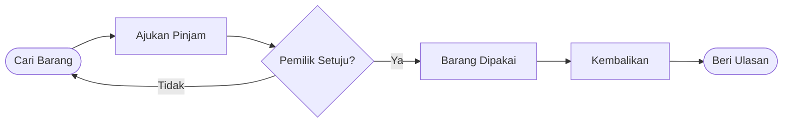
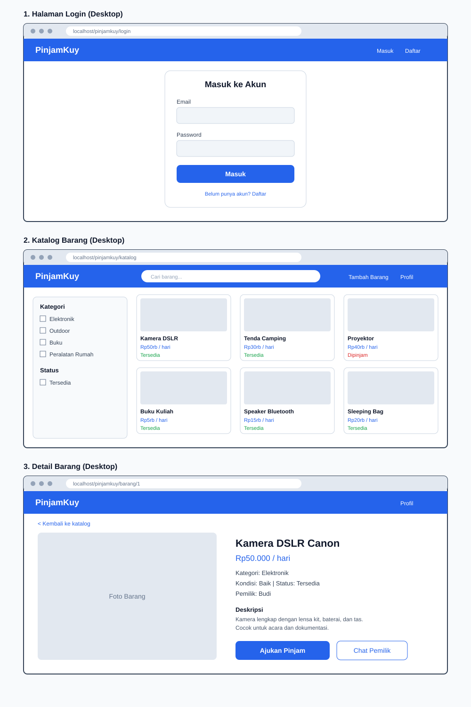

  

  
  
  

  <b>Platform peminjaman barang online untuk mahasiswa dan masyarakat.</b> 
  Punya barang yang jarang dipakai? Pinjamkan. Butuh barang cuma sekali? Pinjam saja.

---

## 📖 Tentang PinjamKuy

Banyak orang butuh barang hanya untuk sekali pakai, seperti **kamera, tenda, proyektor, atau buku kuliah**. Membelinya terasa boros, sementara di sisi lain banyak barang menganggur di rumah orang lain.

**PinjamKuy** mempertemukan keduanya. Alurnya mirip marketplace: ada katalog, pencarian, dan pengajuan, tetapi barangnya **dipinjam, bukan dibeli**.

---

## ✨ Fitur Utama

| | Fitur | Deskripsi |
|---|-------|-----------|
| 🔐 | **Akun Pengguna** | Registrasi, login, dan logout yang aman |
| 📦 | **Katalog Barang** | Jelajahi semua barang yang bisa dipinjam |
| 🔍 | **Pencarian dan Filter** | Temukan barang berdasarkan nama dan kategori |
| 📝 | **Pengajuan Pinjam** | Pilih tanggal, pemilik menyetujui atau menolak |
| 💬 | **Chat** | Ngobrol langsung dengan pemilik barang |
| ⭐ | **Ulasan dan Rating** | Bangun kepercayaan antar pengguna |

---

## 🔄 Alur Peminjaman

---

## 👥 Tim Kami

<table align="center">
  <tr>
    <td align="center" width="260">
      <h3>👨‍💻 Asrianda Imam</h3>
      <b>NIM 240504127</b> 
      Fokus Sprint 1: Registrasi dan Login
    </td>
    <td align="center" width="260">
      <h3>👨‍💻 Muhammad Isfa</h3>
      <b>NIM 240504130</b> 
      Fokus Sprint 1: Tambah Barang, Katalog, dan Detail
    </td>
    <td align="center" width="260">
      <h3>👨‍💻 Wibi Hidayat</h3>
      <b>NIM 240504146</b> 
      Fokus Sprint 1: ERD dan Wireframe
    </td>
  </tr>
</table>

  Program Studi Informatika · Fakultas Sains dan Teknologi · Universitas Samudra

---

## 📄 Dokumen Sprint 1

| Dokumen | Isi |
|---------|-----|
| [📋 Product dan Sprint Backlog](sprint-1.md) | Daftar fitur, prioritas, dan pembagian tugas |
| [🏗️ Arsitektur Sistem](arsitektur-sistem.md) | Struktur client-server 3 lapis |
| [🗄️ ERD Database](erd.md) | Rancangan tabel dan relasinya |
| [🔀 Flowchart](flowchart.md) | Alur login, peminjaman, dan tambah barang |
| [🎨 Wireframe Desktop](wireframe-desktop.svg) | Rancangan tampilan halaman |

---

## 🎨 Wireframe Desktop

  

---

## 🛠️ Teknologi

  
  
  
  
  
  
  
  
  

---

## 🗺️ Roadmap

| Sprint | Target | Status |
|--------|--------|--------|
| **Sprint 1** | Perancangan: backlog, arsitektur, ERD, wireframe, flowchart | ✅ Selesai |
| **Sprint 2** | Registrasi, login, tambah barang, katalog | ⏳ Berikutnya |
| **Sprint 3** | Pengajuan dan persetujuan peminjaman | ⏳ Rencana |
| **Sprint 4** | Chat, ulasan, dan finalisasi | ⏳ Rencana |

---

  <i>Dibuat dengan ☕ dan semangat oleh Kelompok 6</i> 
  <b>PinjamKuy © 2026</b>

  

