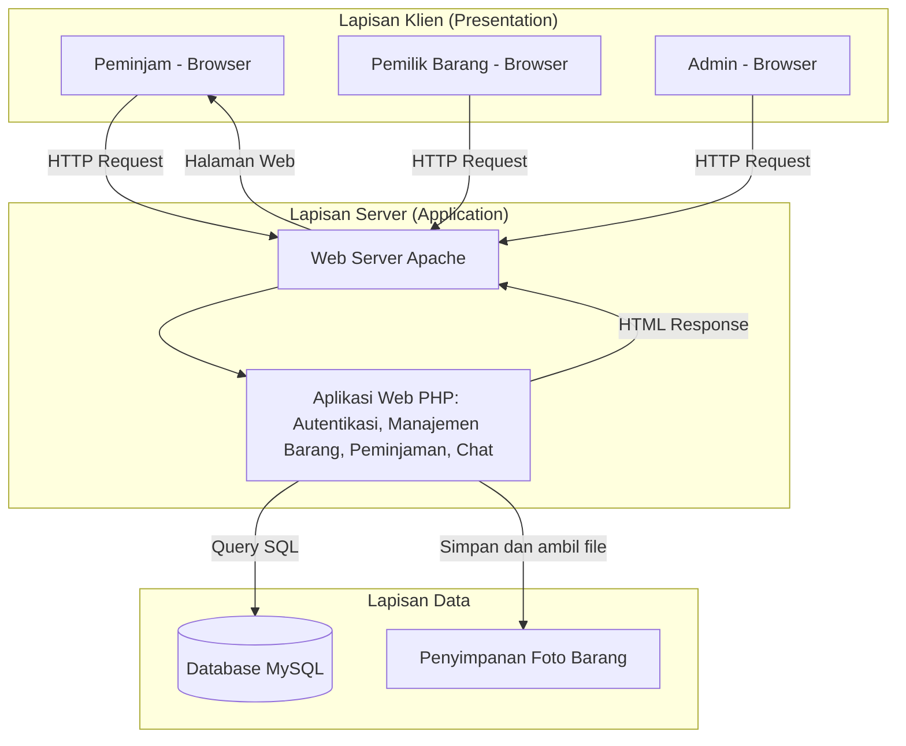

# 🏗️ Arsitektur Sistem PinjamKuy

Arsitektur sistem menggambarkan bagian-bagian aplikasi dan bagaimana bagian itu saling berhubungan. PinjamKuy memakai arsitektur **client-server 3 lapis** (tampilan, logika, dan data).

## Diagram

## Penjelasan Lapisan

| Lapisan | Komponen | Fungsi |
|---------|----------|--------|
| Klien | Browser (Chrome, Edge, dll.) | Menampilkan halaman dan menerima input pengguna |
| Server | Apache + PHP | Menerima permintaan, menjalankan logika (login, katalog, pengajuan pinjam), lalu mengirim halaman |
| Data | MySQL | Menyimpan data pengguna, barang, peminjaman, chat, dan ulasan |
| Data | Folder penyimpanan | Menyimpan foto barang yang diupload pemilik |

## Modul Aplikasi

| Modul | Fungsi | Sprint |
|-------|--------|--------|
| Autentikasi | Registrasi, login, logout | 1 |
| Manajemen Barang | Tambah barang, katalog, detail barang | 1 |
| Peminjaman | Ajukan, setujui/tolak, kembalikan | Berikutnya |
| Chat | Pesan antar pengguna | Berikutnya |
| Ulasan | Rating dan komentar | Berikutnya |

## Teknologi

| Bagian | Teknologi |
|--------|-----------|
| Front-end | HTML, CSS, JavaScript, Bootstrap |
| Back-end | PHP |
| Database | MySQL |
| Server lokal | XAMPP (Apache + MySQL) |
| Version control | Git dan GitHub |
| Editor | Visual Studio Code |
