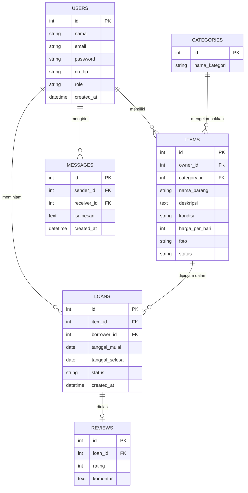

# 🗄️ ERD PinjamKuy

ERD (Entity Relationship Diagram) adalah rancangan tabel database beserta hubungan antar tabelnya.

## Diagram

## Penjelasan Tabel

| Tabel | Fungsi |
|-------|--------|
| `USERS` | Menyimpan data pengguna (pemilik barang dan peminjam). Kolom `role` berisi `user` atau `admin`. |
| `CATEGORIES` | Kategori barang, misalnya Elektronik, Outdoor, Buku. |
| `ITEMS` | Barang yang dipasang pemilik untuk dipinjamkan. `status` berisi `tersedia` atau `dipinjam`. |
| `LOANS` | Data pengajuan dan transaksi peminjaman. `status` berisi `menunggu`, `disetujui`, `ditolak`, `dipinjam`, atau `selesai`. |
| `MESSAGES` | Chat antar pengguna. |
| `REVIEWS` | Rating dan ulasan setelah peminjaman selesai. |

## Penjelasan Hubungan

- Satu **user** bisa memiliki banyak **barang** (1 ke banyak).
- Satu **kategori** berisi banyak **barang** (1 ke banyak).
- Satu **user** bisa punya banyak **peminjaman** (1 ke banyak).
- Satu **barang** bisa dipinjam berkali-kali, di waktu yang berbeda (1 ke banyak).
- Satu **peminjaman** punya paling banyak satu **ulasan** (1 ke 0 atau 1).

## Catatan Sprint 1

Tabel yang dipakai di Sprint 1 adalah `USERS`, `CATEGORIES`, dan `ITEMS` (untuk registrasi, login, katalog, dan detail barang). Tabel `LOANS`, `MESSAGES`, dan `REVIEWS` dipakai di sprint berikutnya.

**Keterangan:** PK = Primary Key (penanda unik tiap baris), FK = Foreign Key (penghubung ke tabel lain).
