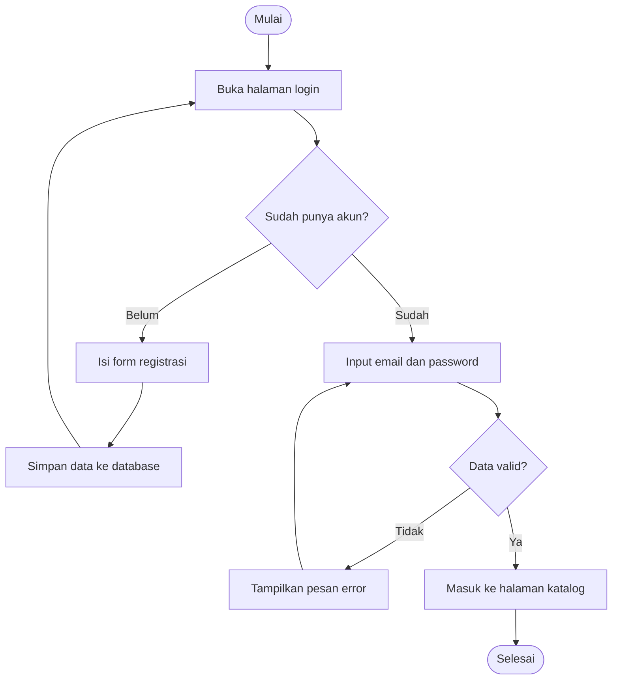
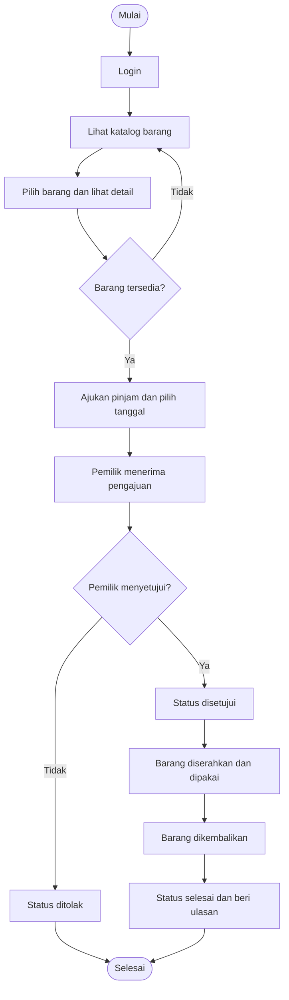
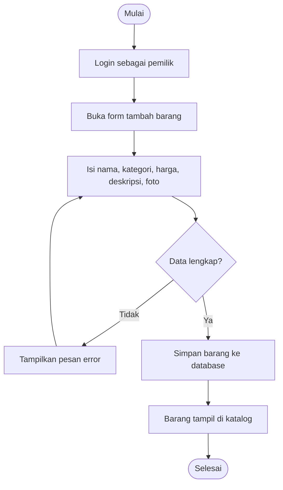

# 🔀 Flowchart PinjamKuy

Flowchart menggambarkan alur langkah-langkah proses di aplikasi.

## 1. Flowchart Registrasi dan Login

## 2. Flowchart Peminjaman Barang

## 3. Flowchart Pemilik Menambah Barang

## Keterangan Simbol

| Simbol | Arti |
|--------|------|
| Oval | Mulai atau selesai |
| Persegi panjang | Proses atau langkah |
| Belah ketupat | Keputusan (ya atau tidak) |
